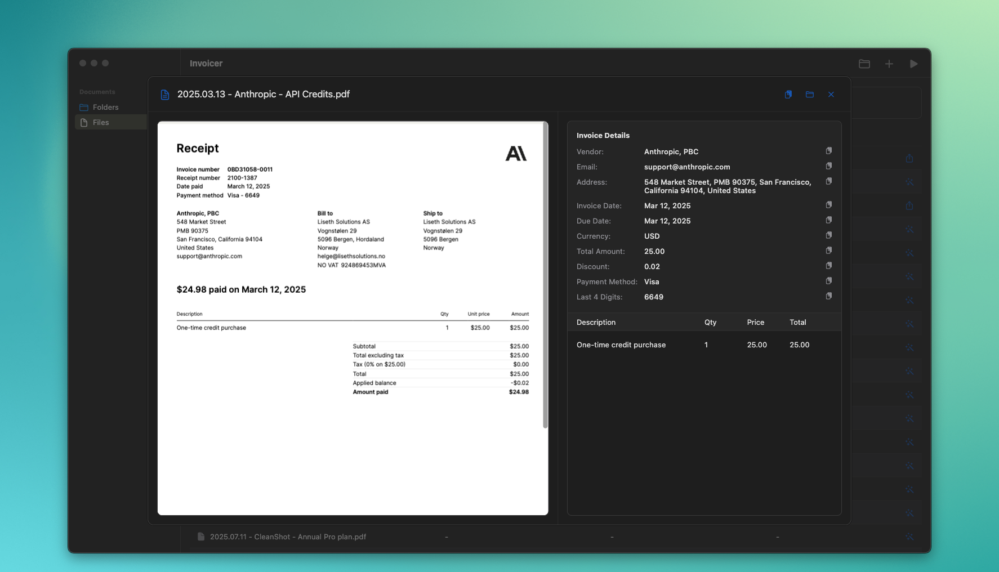

# Invoicer

[](https://flutter.dev/desktop)
[](https://developer.apple.com/macos/)
[](LICENSE)

<p align="center">
  
</p>

A macOS desktop app built with Flutter that extracts structured data from invoice PDFs. The app uses
Syncfusion PDF for text extraction and sends the extracted text to OpenAI via function calling to
produce normalized invoice fields (vendor, dates, items, totals, tax, etc.).

## What it does

- Loads PDF invoices from watched folders or via single-file selection.
- Extracts text from PDFs using Syncfusion PDF.
- Calls the OpenAI API with a function-calling schema to return structured invoice data.
- Displays parsed results and processing status in a native-looking macOS UI (macos_ui).
- Persists settings locally (including API key if set in the settings dialog).

## Requirements

- macOS (desktop target; development requires Xcode toolchain)
- OpenAI API key
- Flutter (managed via fvm; see below)
- CocoaPods for macOS builds (for first-time setup)

## Setup

**1) Install prerequisites**

```bash
# just (task runner)
brew install just

# fvm (Flutter version manager)
brew tap leoafarias/fvm
brew install fvm
```

**2) Clone and prepare**

```bash
git clone https://github.com/HelgeSverre/invoicer.git
cd invoicer
just install
```

**3) Configure OpenAI**

Option A (file-based): copy the example env file and add your API key:

```bash
cp .env.example .env
# Edit .env and replace the placeholder with your actual OpenAI API key
```

The `.env` file should contain:

```env
OPENAI_API_KEY=sk-proj-your-actual-key-here
OPENAI_MODEL=gpt-4.1-mini
```

Option B (in-app): run the app and set the key in the Settings dialog. The key is stored locally (
SharedPreferences).

**4) Run**

```bash
just run
# or: fvm flutter run -d macos
```

## Usage

- Add a folder to watch invoices or add PDFs individually.
- Start processing; the app extracts text from PDFs and sends the text to OpenAI with a
  function-calling schema to return normalized invoice fields.
- Review the parsed output in the Files view; open file details for the full extracted structure.

**Notes:**

- Processing is local except for the OpenAI API call (PDF text is sent to OpenAI).
- Model defaults can be adjusted in code (see extractor notes below).

## Development

This repo uses fvm to pin and consistently use a Flutter SDK version. All justfile commands call
Flutter via fvm.

- Verify your setup: `fvm flutter doctor`
- If you prefer not to install fvm, replace justfile invocations with the equivalent flutter
  commands (but version drift is on you).

### justfile commands

```bash
just            # List available commands
just run        # Run the app in debug mode on macOS
just dev        # Alias for run
just build      # Build a macOS release bundle
just test       # Run unit/widget tests
just analyze    # Static analysis (flutter analyze)
just install    # flutter pub get via fvm
just update     # flutter pub upgrade via fvm
just outdated   # Check for outdated dependencies
just clean      # Clean build artifacts
just reset      # Clean + reinstall dependencies
just pod-install  # Install CocoaPods dependencies for macOS
just pod-reset    # Clean pod artifacts and reinstall
```

### Project structure (high level)

- `lib/main.dart`: app entry point and macOS window setup
- `lib/state.dart`: AppState singleton with signals-based state management (project folders, files,
  status)
- `lib/extractor.dart`: PDF text extraction (Syncfusion), OpenAI function-calling request, Dio +
  cache
- `lib/models.dart`: basic models (PdfDocument, ProjectFolder, ReceiptItem)
- `lib/views/`: folders and files views
- `lib/dialogs/`: settings dialog (API key), file detail dialog

### Architecture overview

- **State management:** signals (reactive, simple, centrally managed in AppState)
- **Data flow:**
  1. PDF(s) loaded from watched folder(s) or by individual file selection
  2. Text extracted with syncfusion_flutter_pdf
  3. Extracted text sent to OpenAI with a function-calling schema
  4. Structured invoice data returned (vendor, dates, line items, amounts)
  5. AppState updates emit reactive UI changes via signals
- **UI:** macos_ui for native macOS look-and-feel
- **Settings:** SharedPreferences; API key via .env or settings dialog
- **Networking:** Dio with caching interceptor for API requests
- **Model defaults:** extractor defaults to gpt-4.1-mini; overrideable via code (
  `extractReceiptData(model: ...)`)

## Building

```bash
just build
# Output: build/macos/Build/Products/Release/
```

If you hit CocoaPods issues:

```bash
just pod-reset
just pod-install
```

## Configuration

**.env file** (loaded via flutter_dotenv):

A `.env.example` file is provided as a template. To configure:

```bash
cp .env.example .env
# Edit .env and replace placeholder values with your actual OpenAI API key
```

Example `.env` contents:

```env
OPENAI_API_KEY=sk-proj-your-actual-key-here
OPENAI_MODEL=gpt-4.1-mini
```

**Note:** The `.env` file is gitignored to keep your API key private.

**Settings dialog** (persisted locally) can also store the key at runtime.

No external backend required; network calls are to the OpenAI API.

## Privacy and data handling

- PDF text is sent to OpenAI during extraction; do not process sensitive documents unless that's
  acceptable for your use-case and OpenAI account/data policies.
- No analytics or telemetry are implemented in this app.
- Syncfusion's Flutter PDF library is used for text extraction (review their license terms for your
  usage).

## Limitations

- PDF extraction fidelity varies with source quality; some invoices may not parse perfectly.
- The OpenAI output depends on the model and prompt/schema; occasional corrections or re-runs may be
  needed.
- Currently targets macOS only.

## Contributing

Issues and PRs are welcome. Keep changes focused and incremental. Prefer existing patterns (signals,
macos_ui, extractor flow) and avoid introducing new dependencies unless necessary.

- Code quality: `just analyze`
- Tests: `just test`
- Style/lints: see `analysis_options.yaml`

## License

This project is open-source. See LICENSE for details.
